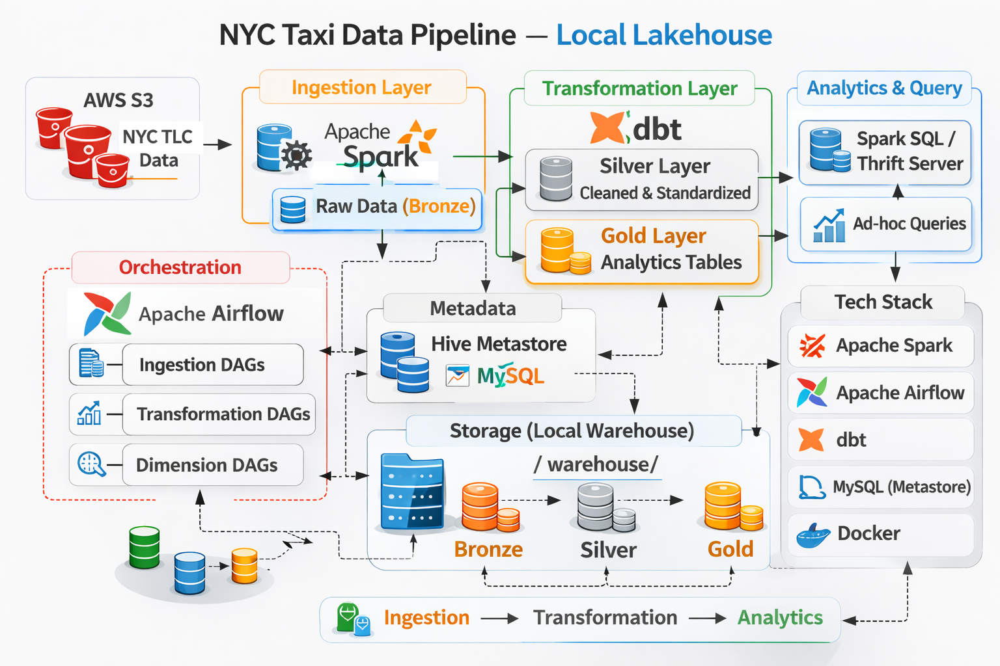

# NYC Taxi Data Pipeline


A production-grade, lakehouse-style data pipeline that ingests NYC Taxi datasets from AWS S3,
processes them with Apache Spark and Delta Lake, transforms them with dbt, and serves curated
analytics tables in Snowflake. The stack runs **locally via Docker Compose** and can be
deployed on **AWS (EC2 + RDS + S3 + IAM + VPC)**.

---

## Table of Contents

- [Motivation](#motivation)
- [Architecture](#architecture)
- [Design Decisions](#design-decisions)
- [Known Limitations & Tradeoffs](#known-limitations--tradeoffs)
- [Tech Stack](#tech-stack)
- [Project Structure](#project-structure)
- [Data Source](#data-source)
- [Airflow DAGs](#airflow-dags)
- [Spark Jobs](#spark-jobs)
- [dbt Models](#dbt-models)
- [Snowflake Serving Layer](#snowflake-serving-layer)
- [Prerequisites](#prerequisites)
- [Deployment — Local](#deployment--local)
- [Deployment — AWS](#deployment--aws)
- [Local vs AWS Comparison](#local-vs-aws-comparison)
- [Access UIs](#access-uis)
- [Useful Commands](#useful-commands)
- [Reset Environment](#reset-environment)
- [Troubleshooting](#troubleshooting)
- [Future Improvements](#future-improvements)

---

## Motivation

The goal of this project is to build a complete, end-to-end data platform from scratch — covering ingestion, 
transformation, orchestration, and serving — using the same tools and patterns found in modern production data stacks.

The NYC Taxi dataset was chosen deliberately: it is large enough to simulate real pipeline behavior 
(~100M+ trip records across 2020–2024) without being prohibitively expensive to process, and it provides a 
natural incremental structure through monthly Parquet files that simulate daily data arriving in a production pipeline.

The pipeline follows a **medallion architecture** (Bronze → Silver → Gold → Snowflake):

- **Bronze** — raw Delta tables ingested from S3 via PySpark, partitioned by month
- **Silver** — cleaned and unified staging models with incremental append, plus hourly aggregation intermediate models with incremental merge
- **Gold** — hourly fact tables and denormalized marts views ready for serving
- **Snowflake** — analytical serving layer receiving the final Gold marts via Spark Snowflake Connector

The stack mirrors what is used in real-world data engineering:

- **Apache Spark** for distributed ingestion from S3
- **Delta Lake** for ACID-compliant table storage with incremental compute
- **dbt** for structured, testable SQL transformations
- **Apache Airflow** for orchestration with dataset-driven DAG dependencies
- **Snowflake** as the analytical serving layer

The platform runs locally via Docker Compose and deploys to AWS (EC2 + RDS + S3) 
without code changes — the same `docker-compose.yml` serves both environments.

---

## Architecture



### Data Flow

```
┌──────────────────────────────────────────────────────┐
│                  AWS S3 (Raw Data)                   │
│  raw/yellow_01_2020.parquet                          │
│  raw/incremental/{year}/{table}_{MM}_{YYYY}.parquet  │
│  raw/taxi_zones.csv                                  │
└────────────────────┬─────────────────────────────────┘
                     │  Spark Jobs (bootstrap / ingestion)
                     ▼
┌──────────────────────────────────────────────────────┐
│              BRONZE LAYER  (Delta Lake)              │
│  bronze.yellow_trip_data  (partitioned by date)      │
│  bronze.green_trip_data                              │
│  bronze.fhv_trip_data                                │
│  bronze.taxi_trip_zones                              │
└────────────────────┬─────────────────────────────────┘
                     │  dbt (bronze views → silver staging)
                     ▼
┌──────────────────────────────────────────────────────┐
│              SILVER LAYER  (Delta Lake)              │
│  silver.stg_taxi_trips      (incremental – append)   │
│  silver.stg_fhv_trips                                │
│  silver.int_taxi_trips_charges  (merge, pickup_month)│
│  silver.int_taxi_trips_revenue                       │
│  silver.int_taxi_trips_zone_activity                 │
└────────────────────┬─────────────────────────────────┘
                     │  dbt (silver → gold)
                     ▼
┌──────────────────────────────────────────────────────┐
│               GOLD LAYER  (Delta Lake)               │
│  gold.fact_charges_hourly    (incremental – merge)   │
│  gold.fact_revenue_hourly                            │
│  gold.fact_zone_activity_hourly                      │
│  gold.dim_date_calendar                              │
│  gold.marts_trips_charges_hourly   (view)            │
│  gold.marts_trips_revenue_hourly                     │
│  gold.marts_trips_zone_activity_hourly               │
└────────────────────┬─────────────────────────────────┘
                     │  Spark Snowflake Connector
                     ▼
┌──────────────────────────────────────────────────────┐
│               SNOWFLAKE  (Serving Layer)             │
│  TAXI_TRIPS.NYC_TAXI.TRIPS_CHARGE_HOURLY             │
│  TAXI_TRIPS.NYC_TAXI.TRIPS_REVENUE_HOURLY            │
│  TAXI_TRIPS.NYC_TAXI.TRIPS_ZONE_ACTIVITY_HOURLY      │
└──────────────────────────────────────────────────────┘
```

### Platform Topology

```
┌───────────────────────────────────────┐
│      LOCAL (Docker Compose)           │
│                                       │
│  ┌───────────┐  ┌───────────────────┐ │
│  │  MySQL    │  │   PostgreSQL      │ │
│  │(metastore │  │ (airflow backend) │ │
│  │ container)│  │    container)     │ │
│  └───────────┘  └───────────────────┘ │
└───────────────────────────────────────┘

┌───────────────────────────────────────┐
│      AWS (EC2 + RDS + S3)             │
│                                       │
│  ┌───────────┐  ┌───────────────────┐ │
│  │ RDS MySQL │  │  RDS PostgreSQL   │ │
│  │(metastore │  │ (airflow backend) │ │
│  │  RDS)     │  │     RDS)          │ │
│  └───────────┘  └───────────────────┘ │
│                                       │
│  EC2 Instance (Docker containers):    │
│  Airflow · Spark · Hive · dbt         │
└───────────────────────────────────────┘
```

---

## Design Decisions

**Medallion architecture with separate incremental strategies per layer**
Bronze uses append-only ingestion — each monthly Parquet file is loaded once and never modified. 
Silver staging models (`stg_taxi_trips`, `stg_fhv_trips`) also use append because the 
UNION logic across sources prevents duplicates naturally. Silver intermediate models and Gold fact tables 
use merge on a unique key, which allows idempotent reprocessing of the last 1–3 months 
without reprocessing the full history. This keeps transformation runs fast after the initial backfill.

**Bootstrap and ingestion as separate DAGs**
The bootstrap DAG initializes the Bronze layer from the first raw files and is designed to run once. 
Separating it from the incremental ingestion DAG enforces idempotency — the bootstrap 
always produces a clean table regardless of how many times it is triggered, with no conditional logic required.

**Yellow and Green schemas unified via Jinja, FHV kept separate**
Yellow and Green taxi data share most columns with only minor differences — primarily 
datetime column names (`tpep_pickup_datetime` vs `lpep_pickup_datetime`) and fee types (`airport_fee` vs `ehail_fee`).
A Jinja macro defines common columns once and handles schema differences through per-source overrides, 
producing a clean UNION in `stg_taxi_trips`. FHV data has fundamentally different structure — only pickup/dropoff
and a dispatcher ID/vendor ID overlap — so it is kept as a separate `stg_fhv_trips` model.

**Monthly partitioning in Bronze**
Source files arrive on a monthly basis. Partitioning by month aligns with the natural granularity of the data
and produces partitions of approximately 2–3M rows — large enough to be efficient for Spark but not so large
as to cause memory pressure. Daily partitioning would produce unnecessarily small files given the source structure.

**Gold marts as views pushed to Snowflake via Spark connector**
Gold marts are materialized as Delta views rather than tables. Spark reads these views and exports them to Snowflake
using the Spark Snowflake Connector. This avoids double-storing aggregated data in both Delta Lake and Snowflake
and keeps Spark as the single compute engine for heavy transformations while Snowflake handles fast analytical queries.
After export, clustering is applied via `ALTER TABLE ... CLUSTER BY` using the Spark Snowflake 
Connector's `runQuery` utility, optimizing analytical queries by `date` and `pickup_location_id`.

**Least-privilege S3 access via IAM**
Locally, a dedicated IAM user with read-only access to a single S3 bucket is used. On AWS, an EC2 IAM Instance Profile
replaces hardcoded credentials entirely. Both approaches follow least-privilege principles and are designed
with future bucket isolation in mind — additional S3 buckets for other projects will not be accessible from this pipeline.

**Dataset-driven DAG dependencies**
The transformation DAG is triggered automatically via Airflow Dataset events rather than a fixed schedule or ExternalTaskSensor.
This ensures transformations run only when Bronze data is actually updated, decoupling the two DAGs without tight scheduling dependencies.

**Dev vs prod materialization**
All Silver and Gold models use `target.name` to switch materialization strategy — views in dev for fast iteration, 
incremental tables in prod. This means `dbt run --target dev` never creates physical tables, while Airflow DAG runs 
against `--target prod` execute the full incremental pipeline as defined in the models. 
Dimension models such as `dim_date_calendar` are always materialized as tables regardless of target.

---

## Known Limitations & Tradeoffs

**No dbt unit tests**
The transformation layer relies on `not_null` and `unique` dbt tests for data quality validation. 
Unit tests for transformation logic — verifying that individual models produce correct output
for a given input — are not implemented. This is a known gap that would be addressed in a production environment.

**No data observability or alerting**
There is no monitoring or alerting if a pipeline run fails silently or if data anomalies appear
— for example, an unexpected drop in row counts or null values in critical columns. 
In production, tools like Great Expectations or dbt's built-in test alerting would be used to catch these issues.

**Delta Lake storage is not persisted to S3**
Delta Lake tables are stored in the local `warehouse/` directory on EC2. In a production environment,
Delta tables should be persisted to S3 for durability and decoupled from the EC2 instance lifecycle.

**Snowflake export is a full overwrite**
Each pipeline run overwrites the Snowflake tables entirely via `mode("overwrite")`.
This is simple and avoids duplicate data but is inefficient at scale — the full Gold mart is re-exported on every run
regardless of how much data has changed. An incremental merge approach would be more appropriate for larger datasets.
Additionally, the export runs as part of `transformation_dag` 
rather than a dedicated DAG, which limits independent triggering and retry control.

---

## Tech Stack

| Component              | Technology                    | Version          |
|------------------------|-------------------------------|------------------|
| Orchestration          | Apache Airflow                | 2.9.3            |
| Distributed Compute    | Apache Spark                  | 3.5.1            |
| Table Format           | Delta Lake                    | 3.1.0            |
| Transformations        | dbt-core + dbt-spark          | latest           |
| Metadata Store         | Hive Metastore                | 3.1.3            |
| Serving Layer          | Snowflake                     | —                |
|                        |                               |                  |
| Metastore DB (local)   | MySQL (Docker container)      | 8.0              |
| Metastore DB (AWS)     | MySQL (Amazon RDS)            | 8.0              |
|                        |                               |                  |
| Airflow Backend (local)| PostgreSQL (Docker container) | 15               |
| Airflow Backend (AWS)  | PostgreSQL (Amazon RDS)       | 15               |
|                        |                               |                  |
| Cloud Storage          | AWS S3                        | —                |
| Containerization       | Docker + Docker Compose       | —                |
| Language               | Python                        | 3.x              |

---

## Project Structure

```
nyc-taxi-data-pipeline/
├── airflow/
│   ├── dags/
│   │   ├── bootstrap_dag.py          # One-time Bronze table initialization
│   │   ├── ingestion_dag.py          # Daily incremental ingestion (Bronze)
│   │   ├── transformation_dag.py     # dbt Silver/Gold + Snowflake export
│   │   └── dim_yearly_dag.py         # Yearly date dimension refresh
│   └── plugins/
│       ├── utilities.py              # Helpers for creating Airflow tasks
│       └── constants.py              # Pipeline constants
│
├── dbt/
│   ├── models/
│   │   ├── bronze/                   # Source-aligned views
│   │   ├── silver/
│   │   │   ├── staging/              # Cleaned, unified staging models
│   │   │   └── intermediate/         # Hourly aggregation models
│   │   └── gold/
│   │       ├── dimensions/           # dim_date_calendar
│   │       ├── facts/                # Hourly fact tables
│   │       └── marts/                # Denormalized analytics marts
│   ├── macros/                       # Reusable SQL macros
│   ├── dbt_project.yml
│   ├── profiles.yml
│   ├── sources.yml
│   └── packages.yml
│
├── src/
│   ├── jobs/
│   │   ├── bootstrap.py              # Creates initial Bronze tables from S3
│   │   ├── ingestion.py              # Incremental monthly ingestion
│   │   ├── dim_taxi_zones.py         # Loads taxi zone dimension
│   │   └── export_to_snowflake.py    # Exports Gold marts to Snowflake
│   └── common/
│       ├── config.py                 # Paths, schemas, start date
│       ├── spark.py                  # Spark session with S3/Delta/Snowflake config
│       └── utils.py                  # Schema normalization, helpers
│
├── docker/
│   ├── spark/
│   │   ├── Dockerfile                # Spark + Delta + Snowflake connector JARs
│   │   ├── spark-defaults.conf
│   │   └── hive-site.xml
│   ├── airflow/
│   │   ├── Dockerfile
│   │   └── airflow.cfg
│   └── dbt/
│       └── Dockerfile
│
├── scripts/
│   └── download-drivers.sh           # Downloads JDBC drivers for Hive Metastore
│
├── requirements/
│   ├── base.txt
│   ├── spark.txt                     # PySpark + Delta Lake
│   ├── airflow.txt                   # Airflow + Docker + Amazon providers
│   └── dbt.txt                       # dbt-core + dbt-spark + dbt-snowflake
│
├── warehouse/                        # Local Delta Lake storage (mounted into containers)
├── .env.example                      # Environment template (local)
├── .env.aws                          # Environment template (AWS) — not committed
└── docker-compose.yml                # Full platform service definitions
```

---

## Data Source

The pipeline ingests publicly available NYC Taxi trip records published by the NYC Taxi & Limousine Commission (TLC):
https://www.nyc.gov/site/tlc/about/tlc-trip-record-data.page

| Property       | Value                                                        |
|----------------|--------------------------------------------------------------|
| Years covered  | 2020 – 2024                                                  |
| Total records  | ~100M+ trip records                                          |
| Format         | Parquet                                                      |
| Storage        | AWS S3 (`s3a://sm-nyc-taxi-tripdata`)                        |
| Data types     | Yellow Taxi, Green Taxi, FHV (For-Hire Vehicles), Taxi Zones |

### S3 Structure

Raw files are organized in S3 under two prefixes:

- `raw/` — Initial seed files (`{table}_01_2020.parquet`, `taxi_zones.csv`)
- `raw/incremental/{year}/{table}_{MM}_{YYYY}.parquet` — Monthly incremental files

Delta Lake tables are stored locally in the `warehouse/` directory, mounted into Spark containers via Docker.

---

## Airflow DAGs

All DAGs live in `airflow/dags/`. Tasks run Spark jobs and dbt 
transformations inside Docker containers via the **DockerOperator**.

### 1. `bootstrap_dag` — Manual trigger (run once)

Initializes the Bronze layer from the first raw Parquet files on S3.
```
bootstrap_data_task
  └─ Reads raw/{yellow,green,fhv}_01_2020.parquet from S3
  └─ Normalizes schema + adds metadata columns
  └─ Writes Delta tables to bronze.{yellow,green,fhv}_trip_data
```

### 2. `ingestion_dag` — Daily at 01:00 UTC

Incremental monthly ingestion into Bronze. Each run advances the watermark by one month.
```
dim_taxi_zones_data
    └─ bronze_vw_taxi_trip_zones
ingestion_data
    ├─ bronze_vw_yellow_trip_data
    ├─ bronze_vw_green_trip_data
    └─ bronze_vw_fhv_trip_data
```

### 3. `transformation_dag` — Triggered by dataset events

Runs automatically when Bronze datasets are updated via Airflow Dataset events — no fixed
schedule or ExternalTaskSensor required. Builds all Silver/Gold dbt models and exports marts to Snowflake.
```
dbt_source_freshness
    ├─ stg_taxi_trips
    └─ stg_fhv_trips
         ├─ int_taxi_trips_charges
         ├─ int_taxi_trips_revenue
         └─ int_taxi_trips_zone_activity
              ├─ fact_charges_hourly
              ├─ fact_revenue_hourly
              └─ fact_zone_activity_hourly
                   ├─ marts_trips_charges_hourly
                   ├─ marts_trips_revenue_hourly
                   └─ marts_trips_zone_activity_hourly
                        ├─ snowflake_trips_charge_hourly
                        ├─ snowflake_trips_revenue_hourly
                        └─ snowflake_trips_zone_activity_hourly
```

### 4. `dim_yearly_dag` — January 1st each year

Builds/refreshes the `gold.dim_date_calendar` date dimension for the new year.
```
gold_dim_date_calendar
  └─ dbt build --select dim_date_calendar
```

---

## Spark Jobs

Spark jobs handle all Bronze layer operations and the final Snowflake export. 
They run via `spark-submit` inside Docker containers, triggered by Airflow's **DockerOperator**.

- **`bootstrap.py`** — Initializes Bronze Delta tables from the first raw Parquet files on S3. Normalizes schema, casts null-typed columns to string, and adds `partition_date` and `processing_time` metadata columns.
- **`ingestion.py`** — Incremental monthly ingestion — reads the next monthly Parquet file from S3 and appends it to the Bronze Delta tables.
- **`dim_taxi_zones.py`** — Loads the taxi zone dimension from S3 CSV into Bronze.
- **`export_to_snowflake.py`** — Exports Gold mart views to Snowflake via the Spark Snowflake Connector. Applies `CLUSTER BY` after export for query optimization.

---

## dbt Models

All dbt models run against the Spark Thrift Server via the `dbt-spark` adapter and are organized by medallion layer — Bronze, Silver, and Gold.

### Bronze (views)

Source-aligned views directly over the Delta tables created by Spark ingestion.

| Model                  | Description              |
|------------------------|--------------------------|
| `vw_yellow_trip_data`  | Yellow taxi schema       |
| `vw_green_trip_data`   | Green taxi schema        |
| `vw_fhv_trip_data`     | For-hire vehicle schema  |
| `vw_taxi_trip_zones`   | Zone lookup table        |

### Silver (incremental Delta tables)

| Model                          | Strategy | Partition              | Description                                                                 |
|--------------------------------|----------|------------------------|-----------------------------------------------------------------------------|
| `stg_taxi_trips`               | append   | partition_date, type   | Unified yellow + green (UNION), standardized columns, business rule filters |
| `stg_fhv_trips`                | append   | partition_date         | Cleaned FHV trips                                                           |
| `int_taxi_trips_charges`       | merge    | pickup_month           | Hourly charges/fees aggregation                                             |
| `int_taxi_trips_revenue`       | merge    | pickup_month           | Hourly revenue aggregation                                                  |
| `int_taxi_trips_zone_activity` | merge    | pickup_month           | Hourly pickup/dropoff zone activity                                         |

### Gold (incremental Delta tables + views)

| Model                              | Type  | Strategy              | Description                        |
|------------------------------------|-------|-----------------------|------------------------------------|
| `dim_date_calendar`                | table | full refresh (yearly) | Date dimension                     |
| `fact_charges_hourly`              | table | merge                 | Base hourly charge facts           |
| `fact_revenue_hourly`              | table | merge                 | Base hourly revenue facts          |
| `fact_zone_activity_hourly`        | table | merge                 | Base hourly zone activity facts    |
| `marts_trips_charges_hourly`       | view  | —                     | Denormalized charge metrics        |
| `marts_trips_revenue_hourly`       | view  | —                     | Denormalized revenue metrics       |
| `marts_trips_zone_activity_hourly` | view  | —                     | Denormalized zone activity metrics |

### Common dbt commands

> **Prerequisites:** Bronze layer must exist. Trigger `bootstrap_dag` and `ingestion_dag` first.

```bash
# Debug dbt connection to Spark Thrift
docker compose run --rm dbt dbt debug

# Run a single model
docker compose run --rm dbt dbt run --select stg_taxi_trips

# Build (run + test) a model
docker compose run --rm dbt dbt build --select stg_taxi_trips

# Run all Silver models
docker compose run --rm dbt dbt run --select silver

# Run all Gold models
docker compose run --rm dbt dbt run --select gold

# Check source freshness
docker compose run --rm dbt dbt source freshness
```

---

## Snowflake Serving Layer

After dbt builds the Gold marts, the pipeline exports them to Snowflake via the
**Spark Snowflake Connector**. This enables fast analytical queries without running Spark.

### Snowflake setup

Create the database and schema before the first export:
```sql
CREATE DATABASE IF NOT EXISTS TAXI_TRIPS;
CREATE SCHEMA IF NOT EXISTS TAXI_TRIPS.NYC_TAXI;
```

### Exported tables

| Snowflake Table               | Source (Gold Mart)                       | Cluster By                      |
|-------------------------------|------------------------------------------|---------------------------------|
| `TRIPS_CHARGE_HOURLY`         | `gold.marts_trips_charges_hourly`        | `date`, `pickup_location_id`    |
| `TRIPS_REVENUE_HOURLY`        | `gold.marts_trips_revenue_hourly`        | `date`, `pickup_location_id`    |
| `TRIPS_ZONE_ACTIVITY_HOURLY`  | `gold.marts_trips_zone_activity_hourly`  | `date`, `pickup_location_id`    |

### Snowflake credentials

Add the following to your `.env` file (see `.env.example`):

```env
SNOWFLAKE_ACCOUNT=<your_account_identifier>
SNOWFLAKE_USER=<your_user>
SNOWFLAKE_PASSWORD=<your_password>
SNOWFLAKE_ROLE=<your_role>
SNOWFLAKE_DATABASE=TAXI_TRIPS
SNOWFLAKE_WAREHOUSE=<your_warehouse>
SNOWFLAKE_SCHEMA=NYC_TAXI
```

Exports run automatically as the final step of `transformation_dag`.

---

## Prerequisites

- Docker + Docker Compose
- Git
- Unix-like shell (macOS / Linux)
- AWS IAM access key with read-only S3 access
- Snowflake account

---

## Deployment — Local

The local setup runs **everything in Docker containers** on your machine. MySQL and PostgreSQL
run as containers replacing RDS.

### First-time setup
```bash
# 1. Clone the repo
git clone https://github.com/evgeni-velikov/nyc-taxi-data-pipeline.git
cd nyc-taxi-data-pipeline

# 2. Download JDBC drivers (required for Hive Metastore connectivity)
./scripts/download-drivers.sh

# 3. Create local warehouse directory (mounted into Spark containers)
mkdir -p warehouse
sudo chmod 777 warehouse

# 4. Copy the env template and fill in your credentials
cp .env.example .env
```

Key variables to set in `.env` for local mode:

```env
# S3 / AWS
AWS_ACCESS_KEY_ID=<your_key>
AWS_SECRET_ACCESS_KEY=<your_secret>

# Hive Metastore — points to the local MySQL container
MYSQL_HOST=mysql
MYSQL_PORT=3306
MYSQL_DATABASE=hive_metastore
MYSQL_USER=hive
MYSQL_PASSWORD=<your_password>

# Airflow backend — points to the local PostgreSQL container
POSTGRES_HOST=airflow-postgres
POSTGRES_PORT=5432
POSTGRES_DB=airflow
POSTGRES_USER=airflow
POSTGRES_PASSWORD=<your_password>

# Snowflake
SNOWFLAKE_ACCOUNT=<your_account>
SNOWFLAKE_USER=<your_user>
SNOWFLAKE_PASSWORD=<your_password>
SNOWFLAKE_ROLE=<your_role>
SNOWFLAKE_DATABASE=TAXI_TRIPS
SNOWFLAKE_WAREHOUSE=<your_warehouse>
SNOWFLAKE_SCHEMA=NYC_TAXI

# Host path (absolute path to the repo on your machine)
HOST_PROJECT_PATH=/absolute/path/to/nyc-taxi-data-pipeline
```

```bash
# 5. Build images
docker compose build

# 6. Start the platform (--profile local starts MySQL + PostgreSQL containers)
docker compose --profile local up -d

# 7. Wait ~40–60 seconds for all services to initialize
docker compose ps

# 8. Install dbt package dependencies
docker compose run --rm dbt dbt deps
```

### Daily start / stop
```bash
docker compose --profile local up -d
docker compose down
```

---

## Deployment — AWS

The AWS setup replaces local MySQL/PostgreSQL containers with **Amazon RDS instances** and runs
the Docker platform on an **EC2 instance**. S3 credentials are provided via an **IAM Instance
Profile** (no hardcoded keys needed on the server).

### AWS Infrastructure

The following resources are required:

#### VPC & Networking

**VPC** with two private subnets for RDS and one public subnet for EC2

- **Security Group — EC2** (inbound rules):

| Port  | Protocol | Source  | Purpose                     |
|-------|----------|---------|-----------------------------|
| 22    | TCP      | Your IP | SSH access                  |
| 8080  | TCP      | Your IP | Spark Master UI             |
| 8081  | TCP      | Your IP | Airflow UI                  |
| 4040  | TCP      | Your IP | Spark Job UI                |
| 7077  | TCP      | EC2 SG  | Spark cluster communication |
| 9083  | TCP      | EC2 SG  | Hive Metastore Thrift       |
| 10000 | TCP      | EC2 SG  | Spark Thrift Server         |

- **Security Group — RDS** (inbound rules):

 | Port | Protocol | Source  | Purpose                          |
 |------|----------|---------|----------------------------------|
 | 3306 | TCP      | EC2 SG  | Hive Metastore (MySQL RDS)       |
 | 5432 | TCP      | EC2 SG  | Airflow backend (PostgreSQL RDS) |

#### RDS Instances

| Instance             | Engine        | Database         | Purpose                  |
|----------------------|---------------|------------------|--------------------------|
| `hive-mysql`         | MySQL 8.0     | `hive_metastore` | Hive Metastore backend   |
| `airflow-postgresql` | PostgreSQL 15 | `airflow`        | Airflow metadata backend |

Both RDS instances must be in the same VPC as the EC2 instance and accessible via the RDS security group.

#### EC2 Instance

- **AMI:** Ubuntu 24.04 LTS
- **Instance type:** `t3.xlarge` or larger (Spark needs sufficient memory)
- **Storage:** 20 GB+ EBS (for Docker images and local warehouse)
- **IAM Instance Profile:** Attach a role with the following S3 policy:

```json
{
  "Version": "2012-10-17",
  "Statement": [
    {
      "Effect": "Allow",
      "Action": ["s3:GetObject", "s3:ListBucket"],
      "Resource": [
        "arn:aws:s3:::sm-nyc-taxi-tripdata",
        "arn:aws:s3:::sm-nyc-taxi-tripdata/*"
      ]
    }
  ]
}
```

> With an Instance Profile attached, Spark uses
> `InstanceProfileCredentialsProvider` automatically — no `AWS_ACCESS_KEY_ID`
> or `AWS_SECRET_ACCESS_KEY` needed on the server.

#### S3 Bucket

The bucket `sm-nyc-taxi-tripdata` must exist and contain the raw NYC Taxi Parquet files
organized as described in [Data Source](#data-source).

---

### Step-by-step AWS Deployment

#### Step 1 — Provision infrastructure

1. Create the VPC, subnets, and security groups as described above.
2. Create the two RDS instances (`hive-mysql` and `airflow-postgresql`) in the private subnet.
3. Launch the EC2 instance (Ubuntu 24.04, t3.xlarge+) with the IAM Instance Profile attached.

#### Step 2 — Install Docker on EC2

```bash
ssh ubuntu@<EC2-PUBLIC-IP>

sudo apt update
sudo apt install -y docker-ce docker-ce-cli containerd.io docker-compose-plugin

sudo systemctl enable docker
sudo systemctl start docker
sudo usermod -aG docker ubuntu
sudo chmod 666 /var/run/docker.sock
```

#### Step 3 — Clone the repository
```bash
git clone https://github.com/evgeni-velikov/nyc-taxi-data-pipeline.git
cd nyc-taxi-data-pipeline
```

#### Step 4 — Configure environment variables
```bash
cp .env.example .env
nano .env  # fill in your values
```

Key variables to set in `.env` for AWS mode:
```env
# Hive Metastore — points to the MySQL RDS endpoint
MYSQL_HOST=<hive-mysql-rds-endpoint>
MYSQL_PORT=3306
MYSQL_DATABASE=hive_metastore
MYSQL_USER=<rds_user>
MYSQL_PASSWORD=<rds_password>

# Airflow backend — points to the PostgreSQL RDS endpoint
POSTGRES_HOST=<airflow-postgresql-rds-endpoint>
POSTGRES_PORT=5432
POSTGRES_DB=airflow
POSTGRES_USER=<rds_user>
POSTGRES_PASSWORD=<rds_password>
AIRFLOW__DATABASE__SQL_ALCHEMY_CONN=postgresql+psycopg2://<rds_user>:<rds_password>@<airflow-postgresql-rds-endpoint>:5432/airflow

# S3 — no access key needed; EC2 Instance Profile handles credentials
# (leave AWS_ACCESS_KEY_ID and AWS_SECRET_ACCESS_KEY empty or omit them)

# Snowflake
SNOWFLAKE_ACCOUNT=<your_account>
SNOWFLAKE_USER=<your_user>
SNOWFLAKE_PASSWORD=<your_password>
SNOWFLAKE_ROLE=<your_role>
SNOWFLAKE_DATABASE=TAXI_TRIPS
SNOWFLAKE_WAREHOUSE=<your_warehouse>
SNOWFLAKE_SCHEMA=NYC_TAXI

# Host path on EC2
HOST_PROJECT_PATH=/home/ubuntu/nyc-taxi-data-pipeline
```

#### Step 5 — Build and start the platform

```bash
# Download JDBC drivers
./scripts/download-drivers.sh

# Create warehouse directory
mkdir -p warehouse
sudo chmod 777 warehouse

# Build images
docker compose build

# Start platform — no --profile local; RDS provides the databases
docker compose up -d

# Wait ~40–60 seconds, then verify
docker compose ps

# Install dbt dependencies
docker compose run --rm dbt dbt deps
```

#### Step 6 — Verify the platform

```bash
# Check dbt can connect to Spark Thrift
docker compose run --rm dbt dbt debug

# Open Airflow UI
# http://<EC2-PUBLIC-IP>:8081  (admin / admin)
```

---

## Local vs AWS Comparison

| Component              | Local                                                   | AWS                                       |
|------------------------|---------------------------------------------------------|-------------------------------------------|
| MySQL (metastore)      | Docker container (`--profile local`)                    | Amazon RDS                                |
| PostgreSQL (Airflow)   | Docker container (`--profile local`)                    | Amazon RDS                                |
| Docker Compose command | `docker compose --profile local up -d`                  | `docker compose up -d`                    |
| S3 credentials         | `AWS_ACCESS_KEY_ID` + `AWS_SECRET_ACCESS_KEY` in `.env` | EC2 IAM Instance Profile (no keys needed) |
| Delta Lake storage     | Local `warehouse/` directory                            | EC2 `warehouse/` directory                |
| Airflow UI             | `localhost:8081`                                        | `<EC2-IP>:8081`                           |
| Spark Master UI        | `localhost:8080`                                        | `<EC2-IP>:8080`                           |

---

## Access UIs

| UI           | Local                  | AWS                          |
|--------------|------------------------|------------------------------|
| Airflow      | http://localhost:8081  | http://\<EC2-IP\>:8081       |
| Spark Master | http://localhost:8080  | http://\<EC2-IP\>:8080       |

**Default Airflow credentials:** `admin` / `admin`

---

## Useful Commands

### Inspect tables via Spark SQL

```bash
docker compose exec spark-thrift spark-sql
```

```sql
SHOW DATABASES;
SHOW TABLES;
SELECT COUNT(*) FROM silver.stg_taxi_trips;
SELECT COUNT(*) FROM gold.marts_trips_revenue_hourly;

-- Verify partitioning
DESCRIBE FORMATTED silver.stg_taxi_trips;
DESCRIBE FORMATTED silver.int_taxi_trips_charges;
```

### Check container logs

```bash
docker compose logs -f airflow-scheduler
docker compose logs -f spark-master
```

### Verify dbt connection

```bash
docker compose run --rm dbt dbt debug
```

---

## Reset Environment

Use this to start from a clean state (wipes all volumes and data):

```bash
# Local
docker compose down -v
docker compose build
docker compose --profile local up -d

# AWS
docker compose down -v
docker compose build
docker compose up -d
```

---

## Troubleshooting

### dbt cannot connect to Spark Thrift

- Ensure the platform is running: `docker compose ps`
- Thrift server may still be initializing — wait 30–60 seconds and retry
- Re-run: `docker compose run --rm dbt dbt debug`

### Metastore / schema inconsistency

If tables exist but queries fail, the metastore may be out of sync with storage:

```bash
docker compose down -v
docker compose --profile local up -d --build   # or without --profile local on AWS
```

### S3 access issues

- **Local:** Verify `AWS_ACCESS_KEY_ID` and `AWS_SECRET_ACCESS_KEY` in `.env`
- **AWS:** Verify the EC2 IAM Instance Profile is attached and has `s3:GetObject` + `s3:ListBucket`
- Ensure the bucket `sm-nyc-taxi-tripdata` exists and contains the expected file structure

### RDS connectivity (AWS only)

- Verify the EC2 security group is allowed in the RDS security group inbound rules
- Both EC2 and RDS must be in the same VPC
- Test connectivity: `nc -zv <rds-endpoint> 3306` (MySQL) or `nc -zv <rds-endpoint> 5432` (PostgreSQL)

---

## Future Improvements

### Data Quality
- Add dbt unit tests to validate transformation logic beyond current `not_null` and `unique` checks

### Infrastructure
- Migrate to AWS EMR + MWAA for a fully managed production deployment
- Add data alerting (anomaly detection on metric values or row counts per partition)

### CI/CD
- Add GitHub Actions workflow for dbt test validation on pull requests
